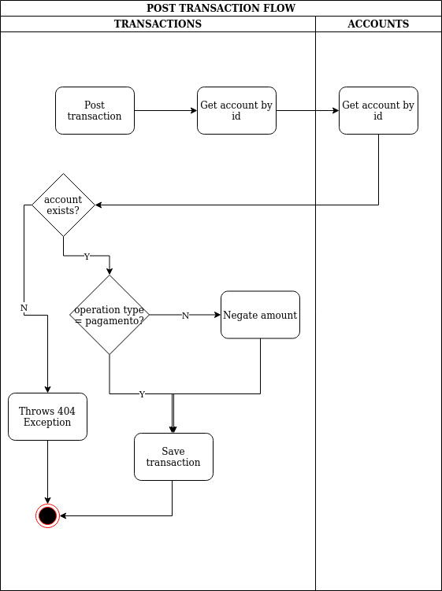

#   PISMO TEST

## THIS IS THE TEST PROJEC FOR PISMO COMPANY

### ACCOUNTS

The objective of the project is to publish api's to allow customers to save new accounts and post transactions to these accounts.

In order to save new account, customer must informer the document number, e.g: 

  ```{
    "document_number": 123456789
  }```

If the document number doesn't exists into database, the account will be saved and an object account will be returned, e.g:

  ```{
    "account_id": 1,
    "document_number": 123456789
  }```

If the document number already exists into database, the system will return an error with 404 http status.

 
### TRANSACTIONS

This is the system core. Through this api is possible to save new transactions related to the account informed in the request. E.g:

  {
     "account_id": 1, 
     "operation_type_id": 1, 
     "amount": 123.45
  }

Something to notice:

- If the account doens't exists, the system will return a 404 http status
- The allowed operation types id's are: 
  - 1 (COMPRA A VISTA)
  - 2 (COMPRA PARCELADA)
  - 3 (SAQUE) 
  - 4 (PAGAMENTO). 

In case of the operation type be _pagamento_, the amount will be saved positive. If not, the amount will be negative.

The api returns the transactions saved, with its respective id.

The following image shows how the transaction api works:



## RUNNING

Inside the folder system, you have the _docker-compose.yml_ file. In order to run the system you just need to run the command: _docker-compose up -d_

The docker you run 5 containers:

- mysql.accounts: Database to store account data
- mysql.transactions: Database to store transactions data
- service-registry: Spring service to register which services are up
- accounts: serivce to provide api's to save accounts
- transactions: service to provide api's to save transactions

To check if the system is up, you can go to localhost:8761 this is the service-registry url. It will show you which services are up.

To test the api's, you can run the following commands:

- curl -X POST -H 'Content-Type: application/json' -d '{"document_number": 123456789}' localhost:8081/v1/accounts -i 
- curl -X POST -H 'Content-Type: application/json' -d '{"account_id": 1, "operation_type_id": 1, "amount": 123.45}' localhost:8082/v1/transactions -i 

The first comand will save an account. The second command will save a transaction. Both commands must return 201 http status.

The system can also be tested through Swagger UI:

- Accounts: http://localhost:8081/swagger-ui.html
- Transactions: http://localhost:8082/swagger-ui.html
